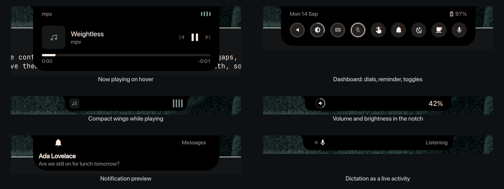

# Omanotch

The MacBook notch as a Dynamic Island for Omarchy. Inspired by
[Alcove](https://tryalcove.com), built for the Omarchy shell on Asahi Linux.



- **Now playing on hover.** Album art, title, artist, seek bar, previous /
  play-pause / next, and a source switch when more than one player is open.
- **Compact wings while music plays.** Art on the left ear, a visualizer on
  the right, the notch untouched in the middle.
- **Volume, brightness and keyboard backlight in the notch.** Omanotch
  declares itself a clone of the stock `omarchy.osd`, so every OSD the shell
  and its scripts send lands here and the bottom-of-screen card is disabled.
  Removing the plugin restores it.
- **Dashboard when nothing is playing.** Date and battery on the ears. On
  the left, level dials for volume, display brightness, keyboard backlight
  and microphone (scroll to adjust, click volume or mic to mute, click the
  keyboard dial to cycle). In the centre, a Reminder button that lights while
  one is pending and opens Omarchy's reminder flow. On the right, Do Not
  Disturb, Night Light, Stay Awake and Dictate toggles. Set
  `showClock` for a clock beside the reminder button; click it to switch
  12/24 hour time.
- **Dictation as a live activity.** Dictate starts voxtype and the island
  shrinks to a pulsing dot, mic glyph and "Listening" pill; hover leaves it
  alone and a click on the pill stops recording. Without voxtype the button
  opens Omarchy's installer.
- **Cards for things that happen.** Charger plugged or pulled, low battery at
  20 % and 10 %, AirPods connecting (per-pod and case battery via the omapods
  daemon's state file), notification previews, and status flashes for Caps
  Lock, microphone mute, screen recording, Do Not Disturb, Night Light, Stay
  Awake and keyboard layout changes.
- **Scroll on the island to change volume.** Click it to pin the card open.

## Install

```bash
omarchy plugin add https://github.com/skuthus/omanotch.git --enable
```

Enabling it disables the stock `omarchy.osd` panel through Omarchy's plugin
clone mechanism (the manifest declares `clonedFrom: "omarchy.osd"`), which is
how every OSD ends up in the notch. Omarchy records that in
`~/.config/omarchy/shell.json` and reverses it on removal.

Meant for a MacBook with a notch (tested on a 14" M-series under Asahi
Linux). On a screen without one it still works as a top-centre island.

Then calibrate the island to your notch once:

```bash
omarchy-shell omanotch calibrate
```

The island turns the accent colour so you can see it against the cutout.
Arrow keys nudge it (`←` `→` width, `↑` `↓` height, hold Shift for bigger
steps), `Enter` saves, `Esc` cancels. The values land in
`~/.config/omarchy/shell.json` under the plugin's entry.

## Remove

```bash
omarchy plugin remove skuthus.omanotch
```

That re-enables the stock OSD. The plugin keeps no state outside its
directory and its `skuthus.omanotch` entry in `~/.config/omarchy/shell.json`,
which holds only the settings below (calibration and preferences you set).

## Dependencies

Everything the plugin needs day to day ships with Omarchy: Quickshell, the
`omarchy-*` audio, brightness, reminder and voxtype scripts, `wpctl`. Optional
extras, each detected at runtime and skipped when absent:

- [cava](https://github.com/karlstav/cava) for a real audio visualizer
  (`pacman -S cava`); without it the bars are a decorative animation
- [voxtype](https://github.com/peteonrails/voxtype) for the Dictate button;
  without it the button opens Omarchy's own voxtype installer
- the [omapods](https://github.com/thisisgm/omapods) daemon for the AirPods
  card; it reads the daemon's status file and does nothing without it

No sudo or pkexec is required.

### Visualizer

The bars use [cava](https://github.com/karlstav/cava) when it is installed
(`pacman -S cava`) and a decorative animation otherwise. cava only runs while
music is playing and the wings or card are visible.

## Settings

All keys live on the `skuthus.omanotch` entry in `plugins[]` of
`~/.config/omarchy/shell.json`.

| Key | Default | Meaning |
| --- | --- | --- |
| `notchWidth` | 184 | Island width in logical px (set by calibration) |
| `notchHeight` | 32 | Island height in logical px (set by calibration) |
| `hoverDelay` | 120 | ms the pointer rests on the island before it expands |
| `leaveDelay` | 350 | ms after the pointer leaves before it collapses |
| `osdDuration` | 1200 | ms an OSD stays when the sender gives no duration |
| `eventDuration` | 3200 | ms for battery, AirPods and similar cards |
| `notificationDuration` | 4500 | ms for notification previews |
| `visualizer` | `auto` | `auto`, `cava`, `fake` or `off` |
| `notifications` | true | Preview incoming notifications |
| `statusFlashes` | true | Caps Lock, mic, recording, DND, Night Light, Stay Awake, layout |
| `batteryEvents` | true | Charger and low-battery cards |
| `airpods` | true | AirPods connect card |
| `scrollVolume` | true | Wheel over the island changes volume |
| `clock24` | false | 24 hour dashboard clock; click the clock to toggle |
| `showClock` | false | Show a clock centred on the dashboard between the dials and toggles |
| `lowBatteryLevels` | `[20, 10]` | Percentages that trigger a low-battery card |

## Theming

The island stays black so it blends into the cutout, and everything drawn on
it follows the active theme the way the shell's popups do:

- text uses the theme's popup text colour when it is legible on black, so a
  warm or cool white carries through; dim text and tracks derive from it
- the accent drives progress bars, the visualizer, active toggles, the
  calibration island and the tint of the empty-art tile, lifted when a theme's
  accent is too dark to read on black
- urgent cards (low battery, critical notifications) use the theme's urgent
  colour

A theme can steer these directly from its `shell.toml`:

```toml
[omanotch]
background = "#000000"   # keep this black on a real notch
text = "#F8EBE3"
accent = "#A5B5AB"
urgent = "#F0334A"
```

## IPC

```bash
omarchy-shell omanotch calibrate   # enter calibration
omarchy-shell omanotch expand      # pin the card open
omarchy-shell omanotch collapse
omarchy-shell omanotch toggle
omarchy-shell omanotch state       # idle | compact | activity | event | expanded | calibrate
omarchy-shell omanotch dictation recording   # drive the dictation pill by hand (recording | transcribing | idle)
omarchy-shell omanotch status      # JSON snapshot for debugging
omarchy-shell osd show '{"icon":"volume","value":"40"}'   # the stock OSD contract
```

## How it works

`Notch.qml` owns one layer-shell window on the built-in panel, anchored to the
top edge on the overlay layer with an input region that covers only the
island. It resolves the island state (`calibrate` > `event` > `expanded` >
`compact` > `idle`), runs the event queue (OSDs jump the queue and update in
place; same-key flashes coalesce; the queue is capped), and hosts the
watchers. The views (`CompactMedia`, `EventRow`, `NotificationRow`,
`NowPlaying`, `Dashboard`, `InlineOsd`) are stateless and read everything off
`notch`. `NotchModel.js` holds all the logic that doesn't touch Qt and is
covered by `tests/`.

An OSD that arrives while the card is open draws in the right ear instead of
collapsing the card. A notification or other card interrupts the expanded
view and hands back to it when it ends.

## Development

```bash
tests/run                 # node tests with coverage, then qmllint
omarchy-restart-shell     # the shell caches compiled QML; a rescan is not enough
```

## License

MIT
